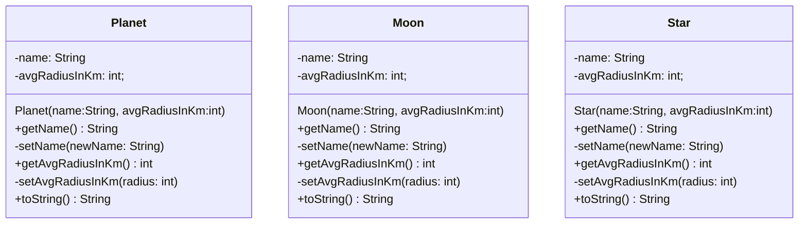
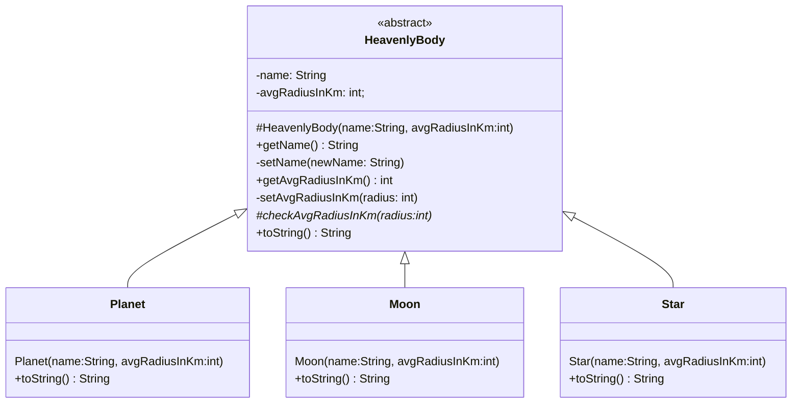
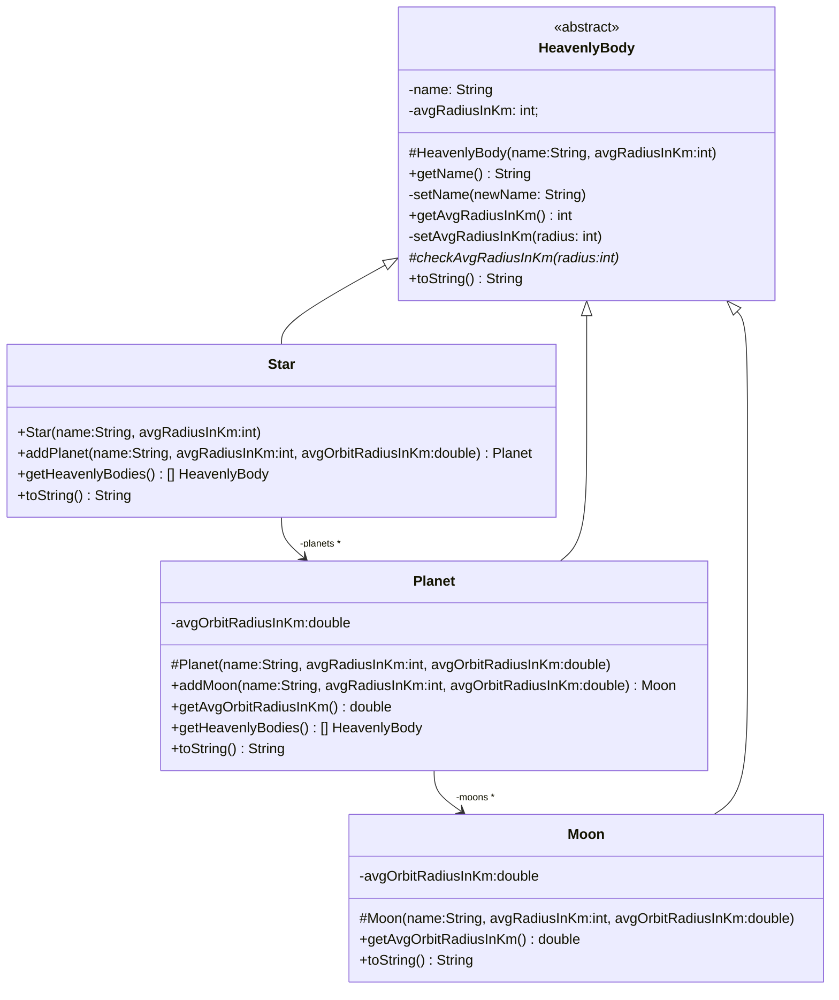
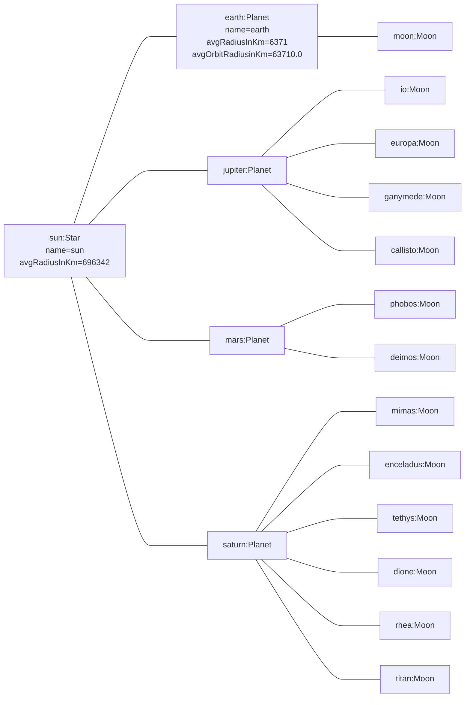
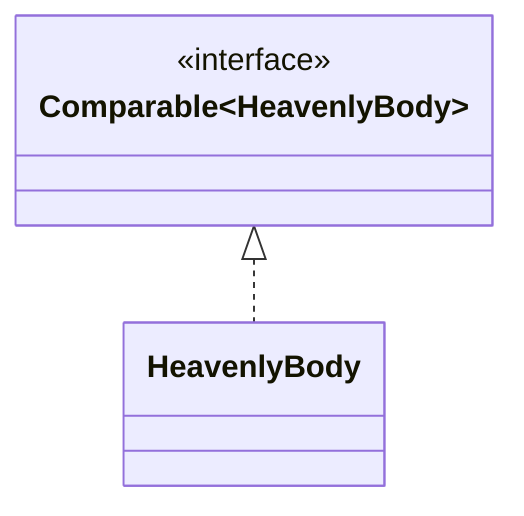

# Object-Oriented-Programming1
This project is about understanding and handling the basics of object orientation in Java. It will contain both coding and modelling to some extent 

This project consists of two parts, one programming part and one modelling part.


## Star Planet Moon
In this task we will start creating a simple OO-implementation of a solar system. We will start by creating the classes Star, Planet and Moon in the package `solitares`. These are the basic objects in our solar system. Use the classes described with UML below. Pay attention to the visibility of methods and attributes, (+, -, #). In this model we are very conservative and will not allow for anyone modifying the information in the objects once they are created. Such objects are often called *immutable* objects, that is their state cannot be changed (i.e. mutate). This is quite an important concept and allowing for mutation is often a source of bugs and errors, but limiting mutation too much can give rise to performance problems and a "hard to work with" design. There are no easy rules for things like this but a matter of designing your code. You will train to reason about such things in several courses.

It is important to not automatically create public setters and getters for every attribute in a class. It is very easy to break encapsulation in this way.

Why do we have setters if they cannot be used from the outside? We could just write the code directly in the constructor. What do you think?  
By adding setters we prepare for the future. If we add another constructor we can directly reuse the setters. Maybe we decide that we will allow for mutation (e.g. making `setName` public) then we are already prepared for this. An immediate benefit is that the constructor code becomes cleaner. In essence this is the *single responsibility principle*: the setter of an attribute should be responsible for making sure that the attribute is not set to something invalid. We want this code in one place.

### Error handling
When objects are created we often want them to be valid, in the sense that they have a valid state. This makes our code more robust if we can trust that if an object is created it is correct. In the case of Star, Planet and Moon objects the `name` attribute must be set to something i.e. they must not be empty. Stars cannot be smaller than 16 700km. Planets cannot be smaller than 2 000km and not larger than 200 000km. Moons cannot be smaller than 6km and not larger than 10 000km.

If these conditions are violated you should throw an `exception` from the respective setter. E.g.

```java
throw new IllegalArgumentException("Name must not be null or empty");
```

#### Throwing Exceptions from Constructor in Java
It is generally good practice to not allow invalid objects to even be created. I.e. you throw an exception from the contstructor if the arguments are invalid or the object cannot be created for some other reason.

Findbugs has, however, started to warn about this practice in Java. The caveat is that when the constructor is called the object is actually allocated (we then find a reason to throw an eception) and needs to be garbage collected. In Java code there is a mehod called `finalize` that is called by the garbage collecor when the object is destroyed. This is a deprecated legacy method introduced in early versions of Java and basically you should not use it. But this essentially means that the `finalize` method will be called on an object that is not 'complete' this could impose some strange behavior and possibly access to resources that should not be allowed if a subclass overrides the `finalize` method.

The simplest solution, that we will use, is to actually implement an empty `finalize` method and make it `final`. This means that it cannot be overriden.

```java
protected final void finalize() {
}
```

The problem we face now is that checkstyle warns for this implementation of `finalize`. The solution here is to simply remove this module from the `config/checkstyle/google_checks.xml` file.

Search for `NoFinalizer` and you should find a line looking like:

```xml
<module name="NoFinalizer"/>
```

Simply remove this line and save the file. Build with gradle and check that everything works.

This is the issue reported by findbugs if you are curious:

```
Exception thrown in class BaseClass at new BaseClass(int) will leave the constructor. The object
      under construction remains partially initialized and may be vulnerable to Finalizer attacks.
    Be wary of letting constructors throw exceptions.
    Classes that throw exceptions in their constructors are vulnerable to Finalizer attacks

    A finalizer attack can be prevented, by declaring the class final, using an empty finalizer declared
      as final, or by a clever use of a private constructor.

    See SEI CERT Rule OBJ-11 for more information.
```


### Printing
We override the `toString` method and let each class be able to convert itself to a nice string. This is often used during development for debugging purposes. The method `toString` is defined in the `Object` class that all classes automatically extends in java.



Also fill in the method in the App class and use the classes by creating some objects that represents our solar system. You should use two arrays to handle the planets and moons, and for loops to print them.

Use the *fully qualified name* when declaring the respective types (as we will continue with refactoring and use the same type names but different packages). For example:

```java
  assignmenttwo.solitares.Star sun = new assignmenttwo.solitares.Star("Sun", 696342);
  System.out.println(sun);
```

The printout could look something like this:

```
Solar System:
  Star: Sun, average radius 696342km

  Planets:
    Planet: Mercury, average radius 2439km
    Planet: Venus, average radius 6051km
    Planet: Earth, average radius 6371km
    Planet: Mars, average radius 3389km
    Planet: Jupiter, average radius 69911km
    Planet: Saturn, average radius 58232km
    Planet: Uranus, average radius 25362km
    Planet: Neptune, average radius 24622km

  Some moons:
    Moon: Moon, average radius 1737km
    Moon: Phobos, average radius 12km
    Moon: Io, average radius 1821km
    Moon: Europa, average radius 1560km
    Moon: Ganymede, average radius 2634km
    Moon: Callisto, average radius 2410km
    Moon: Mimas, average radius 198km
    Moon: Enceladus, average radius 252km
    Moon: Tethys, average radius 533km
    Moon: Dione, average radius 561km
    Moon: Rhea, average radius 764km
    Moon: Titan, average radius 2575km
```

## Heavenly Body
In the above task there was a lot of repetition of the code with some minor differences. When such situations arise you should always stop and think if you can do anything about it. In our case we can see that we have the same attributes the same getters, and the name setters are the same. There is also a conceptual relation between the objects: we consider them all *Heavenly Bodies*. In OO we can utilize such sitations and realize that a heavenly body could be considered a common parent class to our Star, Planet and Moon classes. We see it in the code (as we have code duplication). We conceptually know that a star _is a_ heavenly body, a planet _is a_ heavenly body and a Moon _is a_ heavenly body. It thus seems reasonable to create a parent class `HeavenlyBody` and move the common code to that class. We can also realize that in reality all heavenly bodies are actually either a moon, a planet or Star (at least in our simple model). All objects in reality are of one of these concrete types (but we can mentally reason about the more general concept heavenly body). In the programming code we can enforce this by making the `HeavenlyBody` class abstract, no objects can be directly instantiated from the class `HeavenlyBody`. Note the abstract method `checkAvgRadiusinKM` this needs to be implemented in the respective child class according to the original rules for min and max radii. This method should then be called in the `setAvgRadiusInKm` of `HeavenlyBody` and of course throw an exception if the value is not acceptable.

It is not uncommon that you during programming realize that the code is not as good as you wanted it to be. In such cases we want to transform the code to a better version but keep the functionality of the code. This is called refactoring. If you have automatic tests running it becomes much easier to do refactoring as you gain confidence in that you have not broken the functionality as you refactor your code.

Implement the code in a new package `refactoredsolitares`.



Also fill in the method in the App class and use the classes by creating some objects that represents our solar system. You should use arrays to handle the planets and moons, and some for loop to print them.

Use the fully qualified name when declaring the respective types. For example:

```java
  assignmenttwo.refactoredsolitares.Star sun = new assignmenttwo.refactoredsolitares.Star("Sun", 696342);
```

The result of the printout should be the same as for the solitary version.

## Solar System
Finally we will implement the relation that stars have to planets and planets have to moons and vice versa. This will complete our model of the solar system. In short a star can contain several planets, the planet can contain several moons. We never want any rogue planets and moons, and we also don't want the same moon object to be added to different planets. This would be a very wierd situation that we want to avoid. While we can rely on the programmer using our classes to manage this, it is better if we enforce this and make it impossible (or at least hard) to make misstakes.

A mantra you can use when creating your classes is that "To do the right thing should be a slight thing" for the one using your class. In Swedish this is a bit more fancy: "Det ska vara lätt att göra rätt".

These are rather complicated requirements, but we can handle this by protecting the constructors of Planet and Moon and let the Star and Planet create the objects they should contain. In this way the actual objects are always safely encapsulated within their respective parent.

We also add the rules that a planet cannot have a moon that is larger than half its own size, the minimum orbit radius of a Planet is 18 000km, and minimum orbit radius of a Moon is 60km.

The `toString` methods should be adjusted so that it returns a string that corresponds to the whole hierarchical structure (i.e. the star will add the planets to its string, the planet will add the moons to its string). I.e. using the Sun toString method will give a string that cooresponds to the whole solar system.

Add the classes in a new package `solarsystem`



The moon and planet objects should be stored in an **ArrayList** in the Star and Planet classes respectively.

The method `getHeavenlyBodies` should return an _array_ (that is, _not_ an **ArrayList**) that contains copies of all of the children as well as the parent object. The reason for this is to force you into making an as safe method as possible -- you need to make sure that the returned objects are not the same as the ones stored in the planet object. I.e you should return copies. It is very easy to break encapsulation by just returning references to objects (i.e. returning the ArrayList object or references to the objects contained in the list), in some cases this is fine and what you want, in others not, and depends on the context of the applicaiton.

Fill in the method solar system in the App class and use the classes by creating some objects that represents our solar system in the correct hierarchy. You should print once using the toString method of the top level Star.

It could look like this:

```
Star: Sun, average radius 696342km
  Planet: earth, average radius 6371km, average orbit radius 63710,00km
    Moon: moon, average radius 1737km, average orbit radius 17370,00km
  Planet: mars, average radius 3389km, average orbit radius 33890,00km
    Moon: phobos, average radius 12km, average orbit radius 120,00km
    Moon: deimos, average radius 6km, average orbit radius 60,00km
  Planet: jupiter, average radius 69911km, average orbit radius 699110,00km
    Moon: io, average radius 1821km, average orbit radius 18210,00km
    Moon: europa, average radius 1560km, average orbit radius 15600,00km
    Moon: ganymede, average radius 2634km, average orbit radius 26340,00km
    Moon: callisto, average radius 2410km, average orbit radius 24100,00km
  Planet: saturn, average radius 58232km, average orbit radius 582320,00km
    Moon: mimas, average radius 198km, average orbit radius 1980,00km
    Moon: enceladus, average radius 252km, average orbit radius 2520,00km
    Moon: tethys, average radius 533km, average orbit radius 5330,00km
    Moon: dione, average radius 561km, average orbit radius 5610,00km
    Moon: rhea, average radius 764km, average orbit radius 7640,00km
    Moon: titan, average radius 2575km, average orbit radius 25750,00km
```

The object diagram for the above printout would look something the diagram below (note that we do not show all attributes for all objects in this example):



## Order in Heaven
Lastly we want a final printout of the whole solar system but in a special order, and not in the hieararical way `toString` uses. We want the smallest heavenly body first and the largest last. I.e. we would need to sort the array of HeavenlyBodies we can get from the Star, and then print every object in the array. In order to do this we can let heavenly bodies implement the `java.lang.Comparable` interface override the `compareTo` method and then use the `Arrays.sort` method (the Arrays class has a host of nice functions for working with arrays). In addition you should implement a function that can print a `HeavenlyBody` in the App class and use this method (using toString will not work). Add a new method for showing this task in the App class, called `orderInHeaven`. In UML we would use an interface template/generic type and a realziation relation to show this, it would look something like this (not showing the full types):




Here we can notice that we are reasoning in terms of the abstract concept Heavenly Body. It is very common in human language to work with abstractions, and OO lets us utilize this and implement functionality (like the print method above) that also works on a higher level of abstraction. The method does not care what concrete type of heavenly body it works with, only that it is a heavenly body.

It could look like this

```
Heavenly Body: deimos, average radius 6km
Heavenly Body: phobos, average radius 12km
Heavenly Body: mimas, average radius 198km
Heavenly Body: enceladus, average radius 252km
Heavenly Body: tethys, average radius 533km
Heavenly Body: dione, average radius 561km
Heavenly Body: rhea, average radius 764km
Heavenly Body: europa, average radius 1560km
Heavenly Body: moon, average radius 1737km
Heavenly Body: io, average radius 1821km
Heavenly Body: callisto, average radius 2410km
Heavenly Body: titan, average radius 2575km
Heavenly Body: ganymede, average radius 2634km
Heavenly Body: mars, average radius 3389km
Heavenly Body: earth, average radius 6371km
Heavenly Body: saturn, average radius 58232km
Heavenly Body: jupiter, average radius 69911km
Heavenly Body: Sun, average radius 696342km
```

# Object Oriented Design

This part of the the second assignment is about object oriented design. There is no programming in this part and you will hand in at least one class diagram, one sequence diagram and one object diagram. These diagrams describe your intended design. This assignment links into assignment 3 where you will be presented with a design to the same problem, including working java-code and automatic test cases. You can view the starting point of the third assignment as a suggested solution to this assignment. Therefore, **do not** look at the details of the third assignment until you feel happy with your intended model.

While the goal is to create a design on paper as an exercise. This is quite hard and the end goal is not that it should be perfect, rather that **you should train on thinking in terms of classes and objects and how they collaborate**. There is always changes to the design when the design meets the code (reality) but you will be better prepared for these changes if you have thought about the design a bit before diving into the code. As mentioned part of a later assignment is also to reflect on your own design compared to a "working" design.

You are not graded on how "good" or "correct" your model is from an "is this implementable perspective". This is probably the first OO-model you are creating so it is better to just do something and try to use the different diagrams as they are supposed to be used, studying and learning. See the top of the page for a more detailed description of the grading.

Hint: As you are to write a reflective report later it is a good idea to make some notes about your own thinking during your work. Simply note what you are doing and WHY, it can greatly help when you reflect on your design at a later stage.

You are encouraged to commit and push the changes you make regularly to your main branch. Designing is creative work and often takes time, i.e. you must let your brain work on it. This can seldom be forced, if you get stuck on something move on or take a break. The best ideas often come up when we are doing something completely different.

Often pen and paper are the best tools to start with.

Adopt a learning by doing attitude, it is better that you do something and learn/refine trying to understand everything and create the perfect model (there is no such thing) is futile.

## The Monopoly Game
You are to produce a design for a simple monopoly game. If you are not familiar with the game of monopoly can find plenty of overviews online and you will probably get a basic understanding of the game. Remember that we will only use a subset of the game in the assignment, and part of the problem when designing can actually be to keep a limited scope and not do too much (i.e. make an overly complicated design for some imagined future case). Try to limit your design to the task as described below and do not think about future features that could be nice to have.


### The Board
The board should consist of a number of tiles. Tiles can be of different types as described below, and different rules apply when a player stops on or passes over a tile. The tiles are arranged in a circular way. That is, players move from one tile to the next forward (or backward), and when reaching the last tile they start over at the first tile.

The tile types are:
 * Start tile: There is only one start tile. This is the tile where each player starts. When passing over the start tile a player should get 200 additional credits. Not that this does *not* apply the first time, i.e at the game start.
 * Free tile: Nothing happens on a free tile.
 * Property Tile: Property tiles have a street name and a cost. The following rules apply to when a player stops at a property tile. If it is not owned by a player, it can be bought by the player at the start of the next round (i.e. you buy properties before moving) if the player has enough funds. If another player owns the property you pay rent to that player with the amount of 300 credits.

### The Dice
A player moves over the board by rolling two six-sided dice. The player moves the number of tiles equal to the sum of the dice values. If the dice values show the same values, the player will first move the number of steps shown, and then roll both dice again and move. This continues as long as the player dice show the same values. Note that if the player ends up on a free property tile the player can buy this property before rolling the dice again. If the player ends up on another players property rent must be payed before moving on.

### Starting the Game
Each player enters their names and then gets 1000 credits. The players start at the Start Tile. The game begins when the last player has been added and then no further players can join.

### Playing the Game
Starting with the first player, the player can either buy a property (if currently stopped on a free property tile) and finally roll the dice and move. Movement is always the last thing a player does and it is then the next players turn.

### Ending the Game
The game ends after 10 rounds or when one player has become bankrupt (i.e. has zero or less credits). The winner of the game is the player with the most credits.

## The User Interface
The user interface should be a simple console interface. The game board should be visualized with the tiles and where the players are positioned. All game actions should be reported (i.e. how much a player moves, if credits are added or removed from a player, if a property is bought or if the player pays rent, etc.)

The user interface should be encapsulated in it's own class and any input or output should be handled in this class. I.e. no `System.out.print` or `System.in.read` in any other part of the game.

## Computer Player
In a future version it is expected that there will be a computer player. The design should be prepared for this upcoming feature.

## Class diagram
Create a class diagram that shows the structure of the classes with the appropriate relations. The goal is to end up at a design level class diagram, but it is a good idea to create an analysis level diagram first. Feel free to add this analysis level diagram to your submission. Classes should of course be named, have relevant attributes (fields) and operations (methods). You should use relations between the classes such as generalization/specialization (inheritance), realziation, association or dependency, if appropriate and needed.

## Object and Sequence diagram
To test your design you can try to see how it would work (i.e. how should the objects communicate to perform the task at hand) in particular situation. We call such a situation a scenario. Below is one scenario and you should create one object diagram and one sequence diagram for it using your classes.

The object diagram should show what objects and their links before the steps of the scenario is executed (the initial state). I.e. what does the system look like at this particular moment in time.

The sequence diagram show how the objects are used to perform the steps of the scenario, typically by using the objects from the object diagram. However new objects can also be introduced as the sequence diagram shows the dynamic execution of the system and objects can for example be created.

Considering the user interface it is not a central part of the current scenario. If you think there are messages that need to be sent to/from the user interface, an object of this type is likely needed. However, this is very much up to how you have designed your game.

Note that to be able to send a message between two objects there need to be some relation between them in the class diagram (association or dependency). If you find that your structure (class diagram) is lacking when modeling the scenarios, you should of course try to improve the structure. Feel free to add more scenarios that cover other situations.

### Player moves scenario

#### Initial State
The player named "Boris" is currently at a property with street name "Downing Street". Downing Street is the tile before the Start tile (i.e. it is the last tile on the board). After the start tile comes another property tile ("Seven Sisters Road"), after that we have another property tile ("Abbey Road"). The dice currently have the face value 6 and 2.

#### Steps
1. It is now Boris turn and he is offered the dice. 
2. Boris rolls the dice and gets the values 1 and 2.
3. Boris moves from Downing Street, to the Start tile.
4. Boris moves from the start tile to Seven Sisters Road. As Boris has moved over the start tile, he receives 200 credits.
5. Boris moves from Seven Sisters Road to to "Abbey Road". Boris stops at this tile. As the tile is free Boris is offered to buy this property at the start of his next round.

# Model deliverables In the Assignment
You should create one class diagram, one object diagram and one sequence diagram as per the instructions above. The formats for these should be common image formats like png or jpeg (or you can use mermaid markdown). Use the intended.md, in this file you should present your images and possibly notes that is needed to be able to interpret them correctly using markdown. You should reasonably follow standard UML notation in the diagrams. When done you issue a merge request to the release branch.

