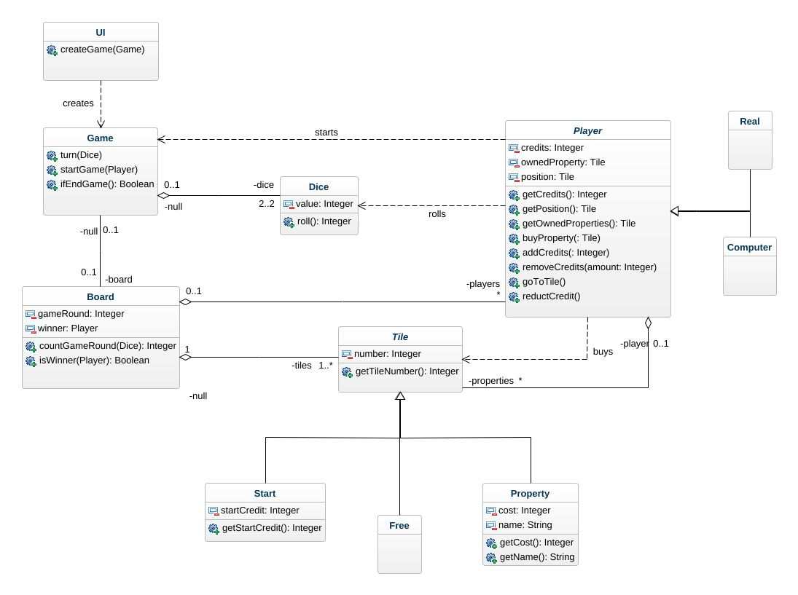
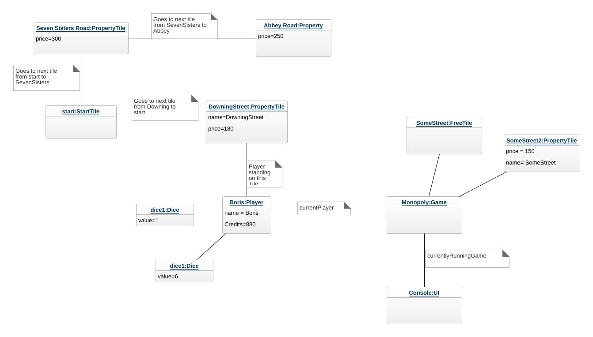
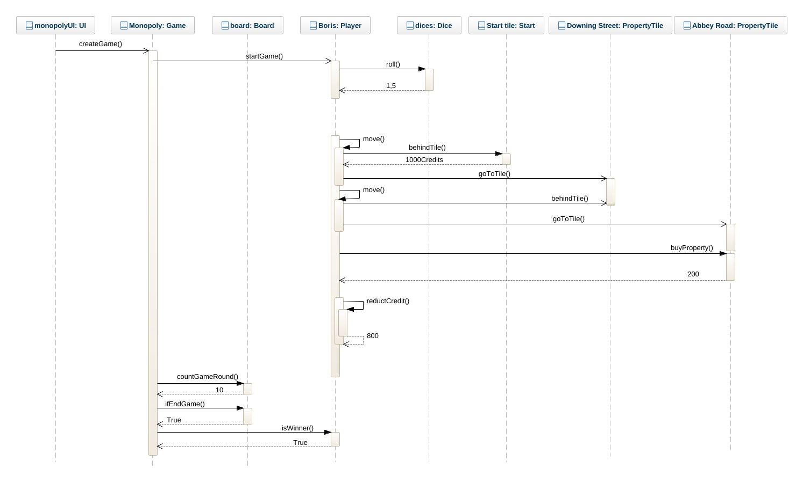

# The Indeded Desing
This is where you add your intended object oriented design of the monopoly game. The images should show when viewing the file in gitlab.  
Include the images in the repo, do not add links to external services etc.

## Class diagram
This is the class  diagram that I designed for monopoly game with the relations. So we have dependencies as shown between Player and Game, UI and Game, Player and Tile, Player and Dice.

There are aggregations between Game and Dice, Tile and Player, Tile and Player and Board, Tile and Board.

An association between Game and Board.

Also two Abstract classes : Tile and Player with Start,Free,Property and Real,Computer subclasses respectively showing the inheritance.

## Object diagram
This is the object diagram as mentioned to be designed in the repository.

## Sequence diagram
This is my sequence diagram which starts like the following:

the UI wil first create the game, then the games will start functioning telling the player to start. The player rolls the dices and gets values returned to them. Then the player will move from start tile and getting the frist game credits and moves to Downingg street. Then the Player will move to Abbey road and buys it and the price will be returned to the player and the player will reduct the current credits of their wallet. then the GAme will count the game rounds and if it is 10, the game ends and the Board will say whi is the winner.

